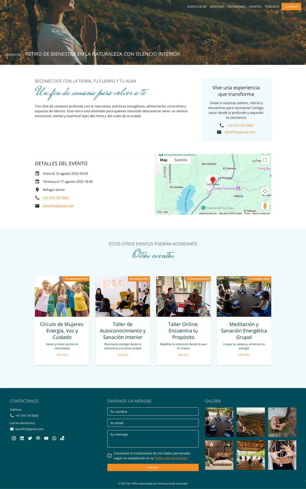

# Multipurpose Next.js Template

A production-ready, multipurpose template built with [Next.js](https://nextjs.org), [Contentful](https://www.contentful.com/), [MUI](https://mui.com/), [next-i18next](https://github.com/isaachinman/next-i18next), [next-seo](https://github.com/garmeeh/next-seo), and more.

## Features
- Contentful CMS integration
- Google Fonts via `next/font`
- SEO and structured data with `next-seo`
- Internationalization (i18n) with `next-i18next`
- Google Analytics integration
- Playwright end-to-end testing
- EmailJS contact form
- Spotify podcast integration
- Google Maps support
- Sitemap and robots.txt generation with `next-sitemap`
- TypeScript, Prettier, ESLint

## Getting Started

### 1. Install dependencies

```bash
npm install
# or
yarn install
```

### 2. Configure environment variables

Copy `.env.example` to `.env` and fill in the required values:

```bash
cp .env.example .env
```

#### Required variables:
- **Contentful**: `NEXT_PUBLIC_CONTENTFUL_SPACE_ID`, `NEXT_PUBLIC_CONTENTFUL_ACCESS_TOKEN`, `NEXT_PUBLIC_ENVIRONMENT`
- **Spotify**: `NEXT_PUBLIC_SPOTIFY_CLIENT_ID`, `NEXT_PUBLIC_SPOTIFY_CLIENT_SECRET`, `NEXT_PUBLIC_SPOTIFY_SHOW_ID`
- **EmailJS**: `NEXT_PUBLIC_EMAILJS_SERVICE_ID`, `NEXT_PUBLIC_EMAILJS_TEMPLATE_ID`, `NEXT_PUBLIC_EMAILJS_USER_ID`
- **Google Maps**: `NEXT_PUBLIC_GOOGLE_MAPS_API_KEY`
- **SEO/Analytics**: `NEXT_PUBLIC_SITE_URL`, `NEXT_PUBLIC_ALLOW_ROBOTS`, `NEXT_PUBLIC_GA_MEASUREMENT_ID`

### 3. Run the development server

```bash
npm run dev
# or
yarn dev
```

Open [http://localhost:3000](http://localhost:3000) to see the app.

## Contentful Setup
- Create a Contentful space and set up content models for pages, events, services, testimonials, etc.
- Add your API keys to `.env`.
- To export/import content, use the Contentful CLI:
  - Export: `contentful space export --space-id <SPACE_ID> --management-token <TOKEN> --content-file export.json`
  - Import: `contentful space import --space-id <SPACE_ID> --management-token <TOKEN> --content-file export.json`

## Scripts
- `dev` – Start development server
- `build` – Build for production
- `start` – Start production server
- `postbuild` – Generate sitemap and robots.txt
- `lint` – Lint code
- `type:check` – TypeScript check
- `test` – Run Playwright tests
- `verify` – Lint, type-check, and test

## Fonts
Google Fonts are loaded and optimized using `next/font`:
- Oswald
- Mrs Saint Delafield
- Open Sans
- Poiret One
- Splash
- Just Me Again Down Here

## SEO & Sitemap
- SEO handled with `next-seo` and custom `<Seo />` component.
- Structured data (JSON-LD) for Organization, Events, Services, etc.
- Sitemap and robots.txt generated with `next-sitemap` (see `next-sitemap.config.js`).

## Testing
- End-to-end tests with [Playwright](https://playwright.dev/):
  ```bash
  yarn test
  ```

## Deployment
Deploy on [Vercel](https://vercel.com/) or any platform supporting Next.js.

## Project Structure

```
multipurpose-template/
├── public/               # Static assets (robots.txt, sitemap.xml, locales, images)
├── src/
│   ├── components/       # Reusable React components (About, Footer, Menu, PodcastsSection, etc.)
│   ├── constants/        # Static values and config (animation, links, regex)
│   ├── helpers/          # Utility functions (date, image, link, getSlugs)
│   ├── hooks/            # Custom React hooks (useGridSize, useScroll, etc.)
│   ├── lib/              # API clients and integrations (contentful, spotify, emailjs)
│   ├── pages/            # Next.js pages and API routes
│   ├── tests/            # Playwright and unit tests
│   └── theme/            # MUI theme customization
├── .env.example          # Example environment variables
├── next.config.ts        # Next.js configuration
├── next-i18next.config.js# i18n configuration
├── next-sitemap.config.js# Sitemap/robots.txt config
├── package.json          # Project metadata and scripts
├── tsconfig.json         # TypeScript configuration
└── README.md             # Project documentation
```


## Demo

Live demo: [https://by-treffry.vercel.app/](https://by-treffry.vercel.app/)

## Screenshots

### Home Page


### Service Details Page


### Event Details Page



## Author

**Anthony Guido**  
[GitHub](https://github.com/anthonyguidomadrid/)  
[LinkedIn](https://www.linkedin.com/in/anthony-guido/)

## Footnotes

- This template is designed for rapid production use and easy customization.
- For questions, suggestions, or contributions, please open an issue or pull request.
- MIT License.
